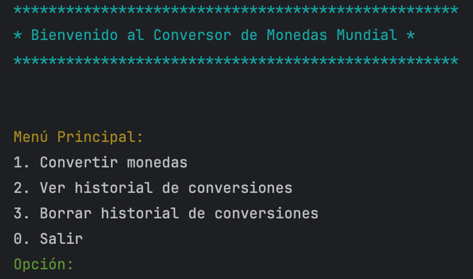
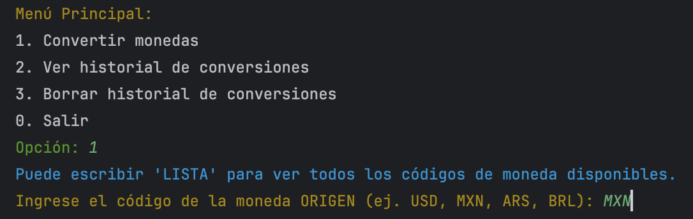
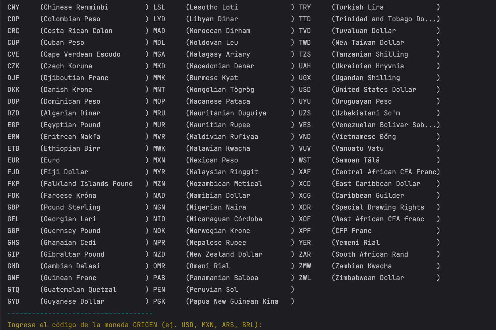
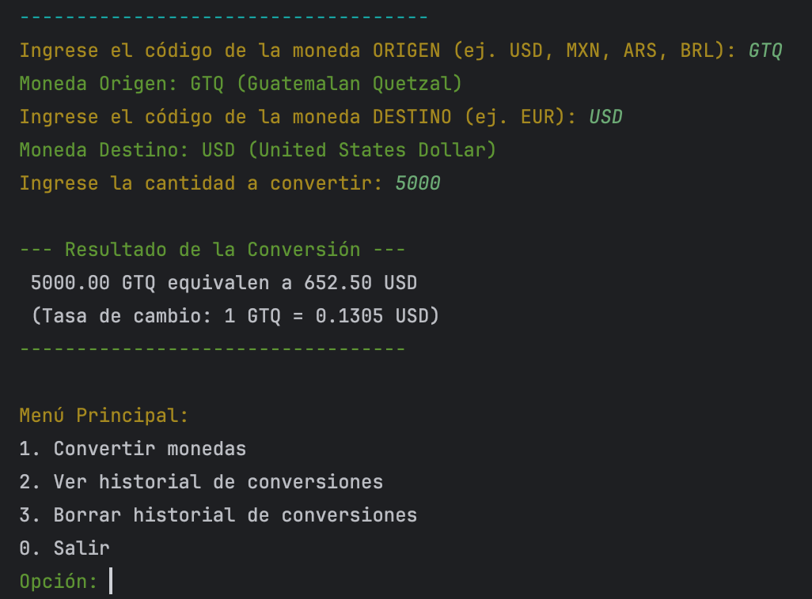
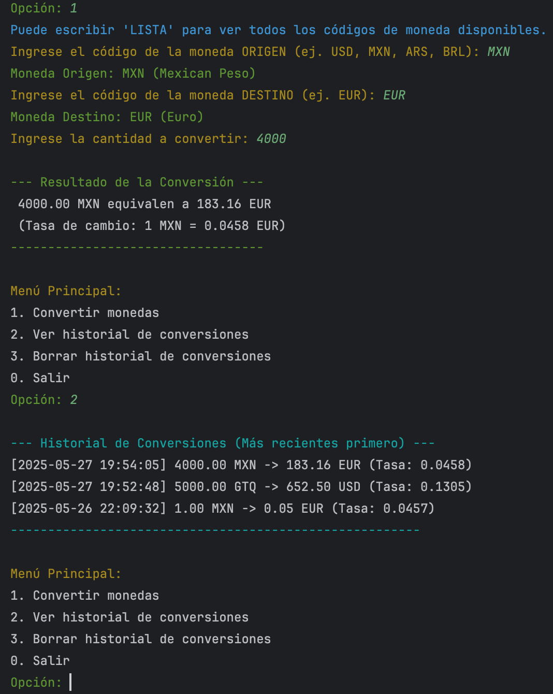
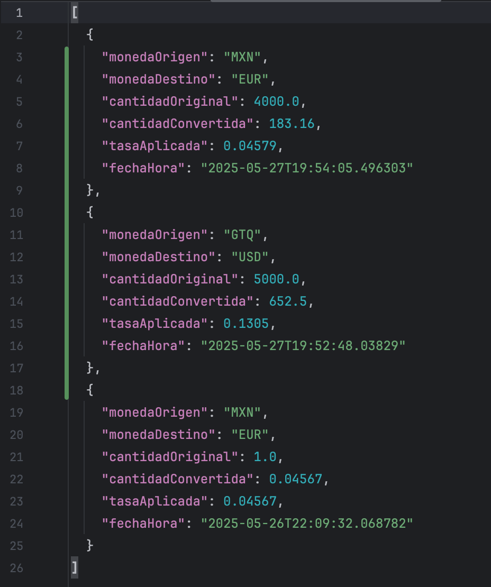

# 💰 Conversor de Monedas Mundial 💰

Hola, Bienvenido/a al Conversor de Monedas Mundial. Esta es una herramienta que te permite saber cuánto vale tu dinero en diferentes monedas del mundo, y se actualiza mediante los datos de internet.

Imagina que quieres viajar, comprar algo en línea que viene con precio en otra moneda, o simplemente por curiosidad de saber cómo se encuentra el tipo de cambio actual de cualquie país. Este programa te ayudará a hacer esos cálculos de forma rápida y sencilla.

---

## 📜 Tabla de Contenidos

* [✨ Qué Hace Este Programa? (Características)](#-qué-hace-este-programa-características)
* [🤔 Cómo Funciona por Dentro?](#-cómo-funciona-por-dentro)
* [🖥️ Un Vistazo a la Aplicación (Capturas de Pantalla)](#️-un-vistazo-a-la-aplicación-capturas-de-pantalla)
* [🔧 Qué Necesito Para Usarlo? (Requisitos)](#-qué-necesito-para-usarlo-requisitos)
* [🚀 A Convertir! Guía Rápida de Uso](#-a-convertir-guía-rápida-de-uso)
* [💡 En Qué Situaciones me Puede Ser Útil?](#-en-qué-situaciones-me-puede-ser-útil)
* [🤓 Para los Curiosos de la Tecnología](#-para-los-curiosos-de-la-tecnología)

---

## ✨ Qué Hace Este Programa? (Características)

Este conversor no es solo una calculadora, tiene algunas otras funciones que podrían ser útiles!:

* **Conversión Actualizada:** Obtiene los tipos de cambio más recientes de Internet para darte cifras precisas.
* **Muchas Monedas Disponibles:** Puedes elegir entre una laaarga lista de monedas de todo el mundo. Si existe, probablemente la puedes convertir!
* **Fácil de Usar:** Tiene un menú sencillo en la consola para que elijas qué quieres hacer entree las opciónes.
* **Ingreso Flexible:** Tú le dices cuánto dinero quieres convertir y de qué moneda a qué moneda.
* **Resultados Claros:** Te muestra el resultado de la conversión de forma clara.
* **Convierte Varias Veces:** Puedes hacer todas las conversiones que quieras sin tener que cerrar y abrir el programa.
* **Guarda tu Historial:** El programa recuerda las conversiones que has hecho. Puedes verlas cuando quieras y se ordenan por fecha y hora.
* **Control de tu Historial:** Si ya no quieres guardar el historial, puedes borrarlo.
* **Guarda y Carga Automáticamente:** Tu historial se guarda en un archivo (`historial_conversiones.json`) para que no se pierda cuando cierres el programa, y se carga cuando lo vuelves a abrir. (Al eliminar tu historial, también se actualiza este archivo).
* **Manejo de Errores:** Si algo no sale como se espera o existe un error (por ejemplo, escribes algo incorrecto o hay un problema con la conexión a Internet para obtener las tasas), el programa intenta manejarlo para que no se rompa y te informa el tipo de error.

---

## 🤔 Cómo Funciona por Dentro? (Si no tienes tanta experiencia con API´s)

Aunque no necesitas saber los detalles técnicos para usarlo, aquí te va una idea general de la magia detrás de este conversor:

1.  **Pide Información a Internet:** Para saber a cuánto está el cambio de, por ejemplo, Dólares a Euros, el programa consulta un servicio especializado en Internet llamado "ExchangeRate-API". Este servicio le da los números actualizados.
2.  **Tú Eliges:**
    * Primero, te pregunta qué quieres hacer (convertir, ver historial, etc.).
    * Si eliges convertir, te preguntará:
        * La moneda que tienes (moneda origen).
        * La moneda a la que quieres convertir (moneda destino).
        * La cantidad de dinero.
    * Si no sabes el código (de tres letras) de una moneda, Puedes escribir "LISTA" y el programa te mostrará todas las monedas disponibles de la API con sus códigos y nombres.
3.  **Hace los cálculos:** Con la información del servicio de Internet y lo que tú le dijiste, hace el cálculo para decirte cuánto sería tu dinero en la otra moneda.
4.  **Te Muestra el Resultado:** Te presenta la cantidad original y la cantidad convertida.
5.  **Recuerda tus conversiónes (Historial):** Cada vez que haces una conversión, el programa escribe los detalles (qué convertiste, cuándo, el resultado) en una tipo de bitácora. Esta bitácora se guarda en tu computadora en un archivo llamado `historial_conversiones.json`.

---

## 🖥️ Vista de la Aplicación (Capturas de Pantalla)

Así se ve el programa en acción.

* **El Menú Principal:** Así te saluda el programa y te da las opciones.
    
  

* **Convertir monedas:** Si sabes los códigos, puedes colocarlos directamente.

    
    
    
* **Eligiendo las Monedas:** Cuando quieres convertir pero no estás seguro de cómo van los códigos.
  Ejemplo de cuando pide "LISTA":
    Puede escribir 'LISTA' para ver todos los códigos de moneda disponibles y luego aplicar los códigos que quieres obtener.
    
    
    

* **Resultado de una Conversión:** Así te muestra el valor de la moneda convertido en el mercado actual.
   Ejemplo:
  
    

* **Viendo tu Historial:** Todas tus conversiones pasadas, bien ordenaditas.
    Ejemplo:
  
    

* **Historial en archivo json:** Todas tus conversiones se guardan en la bitácora del programa en un formato json para que puedas exportarlo si así lo deseas.
    Ejemplo:
  
    
    

---

## 🔧 Qué Necesito Para Usarlo? (Requisitos)

Es sencillo! Solo necesitas un par de cositas:

1.  **Java Instalado en tu Computadora:**
    * **Qué es Java?** Es como un tipo de motor que permite que muchos programas (incluido este conversor) funcionen en tu computadora (Windows, Mac o Linux).
    * **Cómo sé si lo tengo?** Puedes abrir una terminal o símbolo del sistema (busca "cmd" en Windows, o "Terminal" en Mac/Linux) y escribir `java -version`. Si te aparece información de la versión de Java, lo tienes! Si no, necesitarás instalarlo.
    * **Cómo lo instalo?** Puedes descargarlo gratis desde la página oficial de Java: [Oracle Java Downloads](https://www.oracle.com/java/technologies/downloads/). Busca la versión más reciente del "JDK" (Kit de Desarrollo de Java). Las instrucciones de instalación son sencillas. (Se recomienda Java 17 o superior para este proyecto)

2.  **Una "Llave Mágica" para acceder a las Tasas de Cambio (API Key):**
    * **Qué es?** Este programa consulta un servicio en Internet (ExchangeRate-API) para obtener las tasas de cambio. Para que este servicio sepa que tú estas solicidando la información y te la dé, necesitas una "llave" o "clave API". Es como una contraseña para que el programa te deje usar su servicio!
    * **Es gratis?** Sí, ExchangeRate-API tiene un plan gratuito que es más que suficiente para usar este conversor.
    * **Cómo la consigo?**
        1.  Ve a la página [www.exchangerate-api.com](https://www.exchangerate-api.com/).
        2.  Busca la opción para registrarte ("Sign Up" o "Get Free Key"). Solo te piden un correo.
        3.  Una vez registrado, te darán tu API Key. Es una serie larga de letras y números (algo como `abcdef1234567890abcdef123456`). Cópiala y guárdala. La necesitarás en el siguiente paso.
     

---

## 🚀 A Convertir! Guía Rápida de Uso

Sigue estos pasos:

1.  **Descarga el Programa:**
    * Si estás en GitHub, busca el botón verde que dice "**< > Code**".
    * Haz clic y selecciona "**Download ZIP**".
    * Guarda el archivo ZIP en tu computadora y luego descomprímelo en una carpeta que recuerdes (por ejemplo, en tu Escritorio o en Documentos).

2.  **Configura tu "Llave Mágica" (API Key):**
    * Dentro de la carpeta que descomprimiste, busca un archivo llamado `config.properties.example`.
    * Haz una **copia** de este archivo en la **misma carpeta** y renombra la copia a `config.properties` (quitándole el `.example`).
    * Abre el archivo `config.properties` con un editor de texto simple (como el Bloc de Notas en Windows, o TextEdit en Mac).
    * Verás una línea que dice: `API_KEY=TU_API_KEY_AQUI`
    * Borra `TU_API_KEY_AQUI` y pega la API Key que obtuviste de ExchangeRate-API. fíjate que no queden espacios.
    * Guarda el archivo y ciérralo.
    * **Importante:** Este archivo `config.properties` con tu clave secreta es solo para ti. No lo compartas!

---

## 💡 ¿En Qué Situaciones me Puede Ser Útil?

Este tipo de conversor es más útil de lo que parece a primera vista:

* **Planificando Viajes:** Cuánto costará ese hotel en Euros? Cuántos Yenes necesito para mi viaje a Japón?
* **Compras Online Internacionales:** Ese producto en Dólares es realmente una buena oferta al convertirlo a tu moneda local?
* **Trabajadores Remotos y Freelancers:** Si cobras o pagas en moneda extranjera, te ayuda a entender rápidamente los montos.
* **Estudiantes de Intercambio:** Para administrar tu presupuesto en un país nuevo.
* **Curiosidad Financiera:** Simplemente para saber cómo fluctúan las monedas o cuánto valen monedas exóticas.
* **Educación:** Para aprender sobre diferentes monedas del mundo y conceptos económicos básicos.
* **Pequeños Negocios:** Si importas o exportas productos, para tener una idea rápida de los costos y precios.

---

## 🤓 Para los Curiosos de la Tecnología

Si te interesa saber un poco más de cómo está hecho:

* **Lenguaje:** Está programado en Java, un lenguaje muy popular y versátil.
* **Tasas de Cambio:** Utiliza la API de [ExchangeRate-API](https://www.exchangerate-api.com/) para obtener datos en tiempo real.
* **Manejo de Datos JSON:** Usa una librería llamada Gson para leer y entender la información que envía la API (que viene en un formato llamado JSON).
* **Interfaz:** La interacción con el usuario es a través de la consola de comandos.
* **Estructura:** Sigue buenas prácticas de programación, separando la lógica en diferentes "paquetes" y clases para que sea más organizado. Utiliza "records" de Java para manejar los datos de forma eficiente.

**Para Compilar y Ejecutar desde el Código Fuente (si tienes un IDE como IntelliJ IDEA):**

1.  Asegúrate de tener Java JDK (17 o superior) y Apache Maven instalados.
2.  Clona o descarga el proyecto.
3.  Configura tu API Key en `src/main/resources/config.properties` (crea el archivo a partir de `config.properties.example` si es necesario, o directamente en la raíz si así lo has dejado).
4.  Abre el proyecto en tu IDE (IntelliJ IDEA, Eclipse, etc.).
5.  El IDE debería reconocerlo como un proyecto Maven y descargar las dependencias (Gson).
6.  Localiza la clase `AplicacionPrincipal.java` y ejecútala.

---

Espero que disfrutes usando el Conversor de Monedas y que esta guía te haya sido de útil. Nos vemos !
